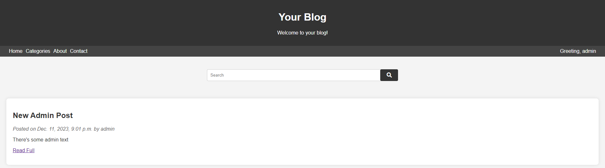

# Simple Blog
    This is an ongoing development project for a blog implemented using Django.
    The blog includes the following features:
     •  Authentication: Users can register, log in, and log out securely to interact with the blog.
     •  Post Management: Creation and display of blog posts with titles, content, and publication dates.
     •  Comment System: Users can add comments to blog posts, and these comments are displayed alongside the posts.
     •  User Profiles: The blog includes user profiles featuring the user's latest posts and comments for a more personalized experience.

## Screenshot

